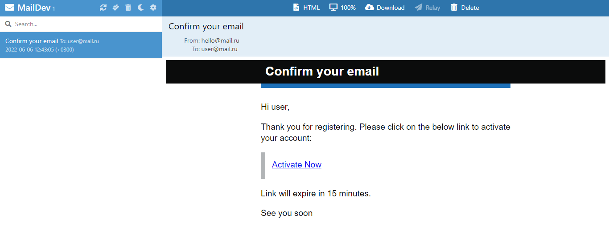

## 1. Technology stack:
* Java 17
* Spring(Boot, Data, Security, Mail)
* Maven
* Docker
* PostgreSQL
* Lombok
* RabbitMQ
* Mapstruct
* Swagger

## 2. Screenshots:
## Registration form 
## Mail confirm http://localhost:1080/ 
## Login form 
## List of users 
## Chats 
## Profile 

## How to run:
* Clone this repository.
* Run commands:
    * cd Micromessenger
    * mvn clean install -DskipTests=true
    * docker-compose build
    * docker-compose up
    * cd client
    * npm run serve

## *APIs:*
You can view the documentation for all endpoints at this url: http://localhost:8080/swagger-ui/index.html
