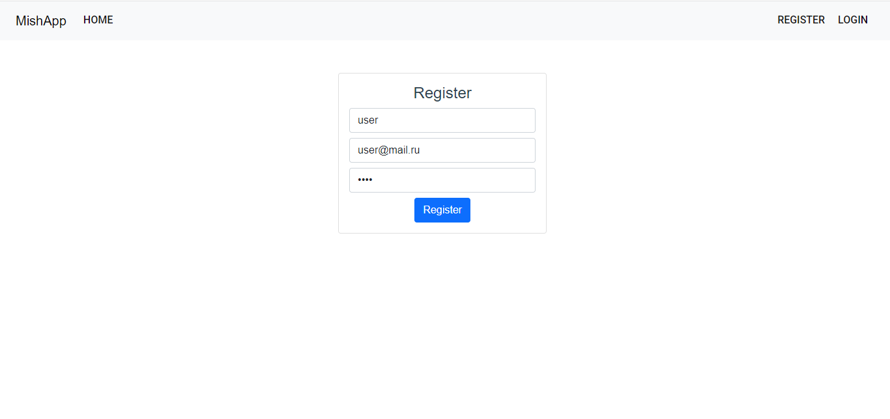
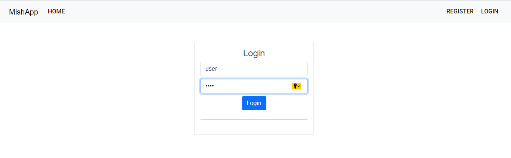
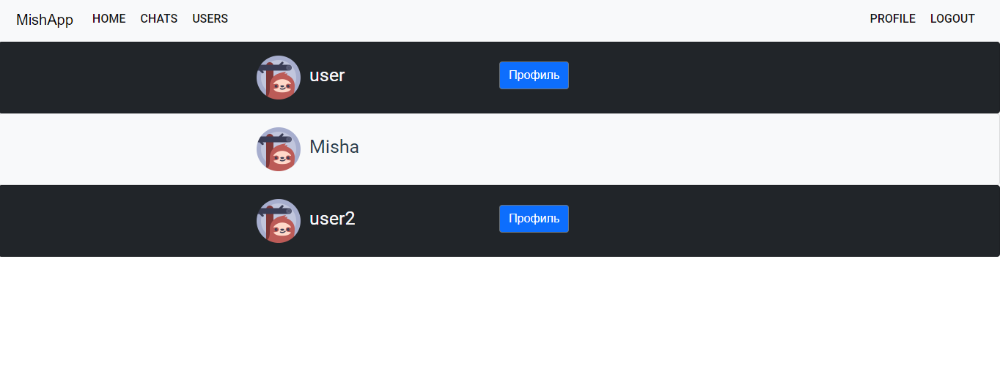
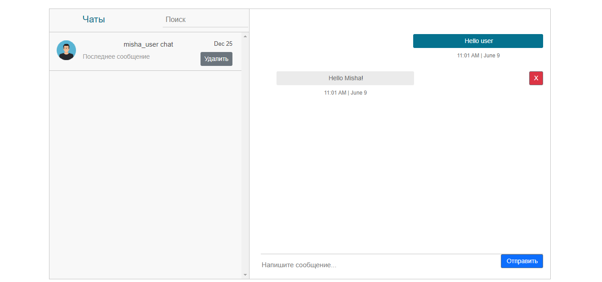
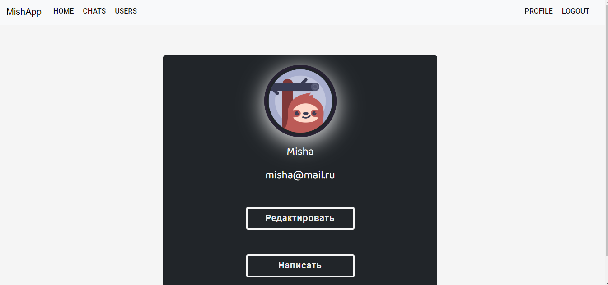

## 1. Technology stack:
* Java 11
* Spring(Boot, Data, Security, Mail)
* Maven
* Docker
* PostgreSQL
* Lombok
* RabbitMQ
* Mapstruct

## 2. Screenshots:

## Registration form

## Login form

## List of users

## Chats

## Profile

